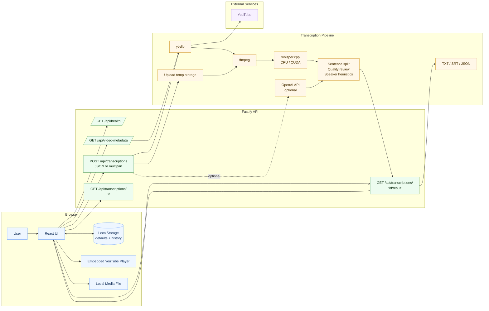

# Segment Transcriber

Local-first web app for transcribing selected parts of YouTube videos or uploaded local audio/video files. It is built for media without subtitles, supports English, Traditional Chinese (Taiwan), and Indonesian, and preserves natural code-switching when speakers mix English into Mandarin or Indonesian.

The default path is fully local with `whisper.cpp`. OpenAI remains optional if you later add an API key.

## What It Does

- Transcribes only the selected time range
- Works with regular YouTube, Shorts, and `/live/...` URLs
- Supports local audio/video upload through the same transcription pipeline
- Fetches video duration before starting
- Validates time ranges against the actual video length
- Supports local CPU and NVIDIA GPU transcription
- Refreshes GPU runtime status while jobs are running
- Shows sentence-level transcript with timestamps
- Embeds a synced YouTube player for click-to-seek playback
- Shows a synced native player for uploaded local audio/video files
- Includes an interactive mode with a collapsed sidebar rail and synced transcript scrolling
- Provides an editable paragraph transcript view
- Includes a local review workflow for approve/edit/reset
- Adds heuristic speaker labels
- Stores reusable local defaults in browser storage
- Stores local video history with title, thumbnail, URL, and search
- Exports `TXT`, `SRT`, and `JSON`

## Stack

- Frontend: React + TypeScript + Vite
- Backend: Fastify + TypeScript
- Audio/video metadata: `yt-dlp`
- Local upload handling: Fastify multipart streaming
- Audio normalization: `ffmpeg`
- Local speech-to-text: `whisper.cpp`
- Tests: Vitest

## System Architecture



## Core Flows

### YouTube Transcription

1. User pastes a YouTube URL
2. Client asks backend for video metadata
3. Backend calls `yt-dlp --dump-single-json`
4. User selects `Start` and `End`
5. Backend validates range against the real video duration
6. Backend extracts only the selected section
7. `ffmpeg` converts audio to mono `16 kHz` using a faster direct PCM conversion path
8. `whisper.cpp` or optional OpenAI transcribes
9. Server builds sentences, heuristics, highlights, and speaker labels
10. Client renders transcript, paragraph view, and YouTube playback sync

### Local File Transcription

1. User chooses `Local File`
2. Browser sends the audio/video file as multipart form data
3. Backend streams the upload to a temporary folder
4. User-selected `Start` and `End` are passed to `ffmpeg`
5. `ffmpeg` cuts and converts the selected section to mono `16 kHz` WAV
6. The same local Whisper/OpenAI, sentence review, and export pipeline runs
7. Client shows the uploaded media in a native audio/video player with click-to-seek transcript sync
8. Temporary uploaded media is deleted after the job cleanup window

Uploaded local files do not create reusable history entries because browsers cannot safely store a permanent path to the original local file.

### History

1. Completed transcription saves the video entry in browser `localStorage`
2. Entry includes title, URL, thumbnail, and saved time
3. User can search by title or URL
4. Clicking a history item restores that URL back into the transcribe form

### Extraction Performance

The slowest stage is usually YouTube audio extraction, not Whisper inference.

Current build changes:

- removes the previous `loudnorm` filter pass
- converts directly to mono `16 kHz` PCM
- drops an extra cut-related download flag that did not help audio-only extraction

What still limits speed:

- YouTube network throughput
- `yt-dlp` section extraction overhead
- source stream responsiveness for long videos

If extraction is still the bottleneck, the next meaningful optimization would be caching downloaded source audio for videos you revisit.

## Requirements

- Node.js 20+
- `yt-dlp`
- `ffmpeg`
- `whisper.cpp`
- A Whisper GGML model file

`yt-dlp` is only needed for YouTube URLs. Local file upload still requires `ffmpeg` plus either `whisper.cpp` or OpenAI mode.

Recommended model:

- `ggml-large-v3-turbo-q8_0.bin`
  - about `834 MiB`
  - best default balance for a normal laptop

Other useful options:

- `ggml-large-v3-turbo-q5_0.bin`
  - about `547 MiB`
  - lighter, slightly weaker accuracy
- `ggml-large-v3.bin`
  - about `2.9 GiB`
  - slower and heavier, sometimes better accuracy

Avoid `.en` models for this project because they are English-only.

## Setup

1. Install dependencies:

   ```powershell
   npm install
   ```

2. Copy `.env.example` to `.env`:

   ```powershell
   Copy-Item .env.example .env
   ```

3. Set `yt-dlp` and `ffmpeg` paths:

   ```env
   YTDLP_BIN=C:\path\to\yt-dlp.exe
   FFMPEG_BIN=C:\path\to\ffmpeg.exe
   ```

4. Download `whisper.cpp` and a model.

   Example CPU install:

   ```powershell
   New-Item -ItemType Directory -Force -Path tools\downloads, tools\whisper.cpp, models
   curl.exe -L -o tools\downloads\whisper-bin-x64.zip https://sourceforge.net/projects/whisper-cpp.mirror/files/v1.8.2/whisper-bin-x64.zip/download
   tar -xf tools\downloads\whisper-bin-x64.zip -C tools\whisper.cpp
   curl.exe -L -o models\ggml-large-v3-turbo-q8_0.bin "https://huggingface.co/ggerganov/whisper.cpp/resolve/main/ggml-large-v3-turbo-q8_0.bin?download=true"
   ```

5. Set `.env`:

   ```env
   WHISPER_CPP_BIN=E:\allProject\13. Youtube Transcribe\tools\whisper.cpp\Release\whisper-cli.exe
   WHISPER_MODEL_PATH=E:\allProject\13. Youtube Transcribe\models\ggml-large-v3-turbo-q8_0.bin
   WHISPER_MODEL_PATH_LARGE_V3_TURBO_Q8_0=E:\allProject\13. Youtube Transcribe\models\ggml-large-v3-turbo-q8_0.bin
   WHISPER_MODEL_PATH_LARGE_V3_TURBO_Q5_0=
   WHISPER_MODEL_PATH_LARGE_V3=
   UPLOAD_MAX_BYTES=2147483648
   PORT=8787
   OPENAI_API_KEY=
   ```

   `WHISPER_MODEL_PATH` is kept as the default fallback. If you select `large-v3` or `large-v3-turbo-q5_0` in the UI, set the matching model-specific path too. The backend checks the selected model before extraction starts, so choosing `large-v3` without downloading `ggml-large-v3.bin` fails early with a clear error.

   `UPLOAD_MAX_BYTES` controls the maximum local media upload size. The default is `2147483648` bytes, which is `2 GiB`.

6. Start the app:

   ```powershell
   npm run dev
   ```

7. Open:

   ```text
   http://127.0.0.1:5173
   ```

## NVIDIA GPU Acceleration

This project supports NVIDIA GPUs when `WHISPER_CPP_BIN` points to a CUDA/cuBLAS `whisper-cli.exe`.

Example Windows setup:

1. Install an NVIDIA driver
2. Download a CUDA build, for example:
   - `whisper-cublas-12.4.0-bin-x64.zip`
   - `whisper-cublas-11.8.0-bin-x64.zip`
3. Extract it into an ignored local folder such as `tools\whisper.cpp-cuda`
4. Update `.env`:

   ```env
   WHISPER_CPP_BIN=E:\allProject\13. Youtube Transcribe\tools\whisper.cpp-cuda\Release\whisper-cli.exe
   WHISPER_MODEL_PATH=E:\allProject\13. Youtube Transcribe\models\ggml-large-v3-turbo-q8_0.bin
   WHISPER_MODEL_PATH_LARGE_V3_TURBO_Q8_0=E:\allProject\13. Youtube Transcribe\models\ggml-large-v3-turbo-q8_0.bin
   ```

The model file is the same. Only the executable changes.

## Runtime Checks

The app verifies these local prerequisites:

- `yt-dlp`
- `ffmpeg`
- `whisper-cli`
- Whisper model file

If anything is missing or broken, the UI shows which check failed. The GPU status line also refreshes while jobs are running so you can tell whether CUDA is active or the app has fallen back to CPU mode.

## Usage

1. Choose `YouTube` or `Local File`
2. Paste a YouTube URL or pick an audio/video file
3. For YouTube, wait for video duration lookup
4. Enter `Start` and `End`
5. Choose language and model
6. Click `Transcribe Segment` or `Transcribe File`
7. Review the result in:
   - `Transcript`
   - `Editable Paragraph`
8. Use `History` in the left panel to reuse prior YouTube videos
9. Open the settings icon in the control panel to change default language and model

## Transcript Review

Transcript view supports:

- click-to-seek playback
- interactive mode playback with synced transcript scrolling
- speaker labels
- review filters
- compact symbol actions for approve / needs-review / edit / reset

The paragraph view is designed for freeform editing and copying.

In the current UI, the settings control is an icon button in the control panel header, and interactive mode shifts the workspace into a player-first layout with the transcript controls moved to the bottom.

## History

History is stored in browser `localStorage` and includes:

- title
- URL
- thumbnail
- duration
- save time

It is local to the browser on that machine.

## Local Settings

The browser stores:

- default language
- default local model

These values are applied automatically on load. They are available from the `≡` settings drawer in the control panel.

## Export Formats

- `TXT` -> `transcript.txt`
- `SRT` -> `transcript.srt`
- `JSON` -> `transcript.json`

## Optional OpenAI Mode

If you add `OPENAI_API_KEY`, the UI can use OpenAI as an optional provider. Local mode remains the default.

## Development

Run development mode:

```powershell
npm run dev
```

Run tests:

```powershell
npm test
```

Build production assets:

```powershell
npm run build
```

## Project Structure

```text
src/
  client/       React UI
  server/       Fastify API and transcription pipeline
  shared/       Shared TypeScript types
tests/          Vitest tests
tools/          Local ignored binaries
models/         Local ignored Whisper models
```

## Git Ignore Notes

These local artifacts are intentionally ignored:

```gitignore
models/
tools/
.env
node_modules/
dist/
```

Do not commit local binaries, models, build output, or machine-specific environment files.

## Notes

- Captions are not required.
- The transcript preserves the spoken language. It does not translate by default.
- Speaker diarization is currently heuristic, not model-based.
- Review state and history are currently local browser state, not server persistence.
