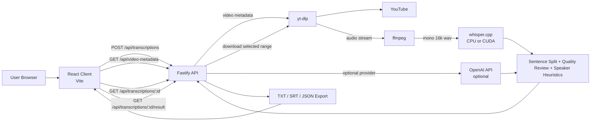

# YouTube Segment Transcriber

Local-first web app for transcribing selected parts of YouTube videos from audio. It is built for videos with no subtitles, supports English, Traditional Chinese (Taiwan), and Indonesian, and preserves natural code-switching when speakers mix English into Mandarin or Indonesian.

The app runs locally by default with `whisper.cpp`, and can optionally use the OpenAI API if you add an API key later.

## Features

- Transcribe only a selected video range with `HH:MM:SS`
- Works with regular YouTube, Shorts, and `/live/...` URLs
- Local transcription with `whisper.cpp`
- Optional NVIDIA GPU acceleration with CUDA/cuBLAS builds
- Optional OpenAI transcription mode
- Runtime prerequisite checks for `yt-dlp`, `ffmpeg`, `whisper-cli`, and the model file
- Video duration lookup and range validation before job start
- Sentence-by-sentence transcript with timestamps
- Click-to-play transcript sync with embedded YouTube player
- Editable plain-text transcript view
- Quality review workflow with approve/edit/reset states
- Heuristic speaker diarization (`Speaker 1`, `Speaker 2`)
- Export as `.txt`, `.srt`, and `.json`

## Tech Stack

- Frontend: React + TypeScript + Vite
- Backend: Fastify + TypeScript
- Audio extraction: `yt-dlp`
- Audio normalization: `ffmpeg`
- Local speech-to-text: `whisper.cpp`
- Tests: Vitest

## System Architecture



## Requirements

- Node.js 20+
- `yt-dlp`
- `ffmpeg`
- `whisper.cpp`
- A Whisper GGML model file

Recommended model:

- `ggml-large-v3-turbo-q8_0.bin`
  - about `834 MiB`
  - best default balance for a normal laptop

Other useful options:

- `ggml-large-v3-turbo-q5_0.bin`
  - about `547 MiB`
  - lighter, slightly weaker accuracy
- `ggml-large-v3.bin`
  - about `2.9 GiB`
  - heavier, slower, often better accuracy

Avoid `.en` models for this project because they are English-only.

## Setup

1. Install project dependencies:

   ```powershell
   npm install
   ```

2. Copy `.env.example` to `.env`:

   ```powershell
   Copy-Item .env.example .env
   ```

3. Install or point to `yt-dlp` and `ffmpeg`.

   Example `.env`:

   ```env
   YTDLP_BIN=C:\path\to\yt-dlp.exe
   FFMPEG_BIN=C:\path\to\ffmpeg.exe
   ```

4. Download `whisper.cpp` and the model.

   Example PowerShell commands for CPU build:

   ```powershell
   New-Item -ItemType Directory -Force -Path tools\downloads, tools\whisper.cpp, models
   curl.exe -L -o tools\downloads\whisper-bin-x64.zip https://sourceforge.net/projects/whisper-cpp.mirror/files/v1.8.2/whisper-bin-x64.zip/download
   tar -xf tools\downloads\whisper-bin-x64.zip -C tools\whisper.cpp
   curl.exe -L -o models\ggml-large-v3-turbo-q8_0.bin "https://huggingface.co/ggerganov/whisper.cpp/resolve/main/ggml-large-v3-turbo-q8_0.bin?download=true"
   ```

5. Set `.env`:

   ```env
   WHISPER_CPP_BIN=E:\allProject\13. Youtube Transcribe\tools\whisper.cpp\Release\whisper-cli.exe
   WHISPER_MODEL_PATH=E:\allProject\13. Youtube Transcribe\models\ggml-large-v3-turbo-q8_0.bin
   PORT=8787
   OPENAI_API_KEY=
   ```

6. Start the app:

   ```powershell
   npm run dev
   ```

7. Open:

   ```text
   http://127.0.0.1:5173
   ```

## NVIDIA GPU Acceleration

This project can use an NVIDIA GPU if `WHISPER_CPP_BIN` points to a CUDA/cuBLAS `whisper-cli.exe`.

For Windows:

1. Install an NVIDIA driver
2. Download a CUDA whisper.cpp build, for example:
   - `whisper-cublas-12.4.0-bin-x64.zip`
   - `whisper-cublas-11.8.0-bin-x64.zip`
3. Extract it into an ignored local folder such as `tools\whisper.cpp-cuda`
4. Update `.env`:

   ```env
   WHISPER_CPP_BIN=E:\allProject\13. Youtube Transcribe\tools\whisper.cpp-cuda\Release\whisper-cli.exe
   WHISPER_MODEL_PATH=E:\allProject\13. Youtube Transcribe\models\ggml-large-v3-turbo-q8_0.bin
   ```

The model file stays the same. Only the executable changes.

## Runtime Checks

On startup and in the UI, the app checks:

- `yt-dlp`
- `ffmpeg`
- `whisper-cli`
- Whisper model file

If any local prerequisite is missing or broken, the UI shows which one failed.

## Usage

1. Paste a YouTube URL
2. Wait for the app to fetch the total video duration
3. Enter `Start` and `End` times
4. Choose language and model
5. Click `Transcribe Segment`
6. Review the result in either:
   - `Transcript`
   - `Editable Paragraph`

In transcript view you can:

- click timestamps to seek the embedded YouTube player
- inspect speaker labels
- approve, edit, reset, or mark lines for review
- filter by review state

## Export Formats

- `TXT` -> `transcript.txt`
- `SRT` -> `transcript.srt`
- `JSON` -> `transcript.json`

## Local Settings

The browser stores these defaults in `localStorage`:

- default language
- default local model

These defaults are applied automatically when the page loads.

## Optional OpenAI Mode

If you add `OPENAI_API_KEY`, the UI can use OpenAI as an optional provider. Local mode remains the default.

## Development

Run the app:

```powershell
npm run dev
```

Run tests:

```powershell
npm test
```

Build production assets:

```powershell
npm run build
```

## Project Structure

```text
src/
  client/       React UI
  server/       Fastify API, tool integration, transcript pipeline
  shared/       Shared TypeScript types
tests/          Vitest tests
tools/          Local ignored binaries
models/         Local ignored Whisper models
```

## Git Ignore Notes

These local artifacts are intentionally ignored:

```gitignore
models/
tools/
.env
node_modules/
dist/
```

Do not commit local binaries, models, build output, or machine-specific environment files.

## Notes

- Captions are not required.
- The transcript preserves the spoken language. It does not translate by default.
- Speaker diarization is currently heuristic, not model-based.
- The review workflow is local UI state; it does not yet persist to disk.
