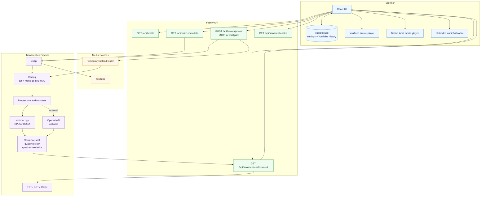

# ScribeLocal

Local-first transcription for YouTube segments and local audio/video files.

ScribeLocal is a web app for transcribing only the part of a video or audio file you care about. It is designed for students, researchers, and makers who want a free local workflow first, with optional OpenAI API support later. The default path uses `whisper.cpp` locally, so uploaded files and most transcription work stay on your machine.

> Project name note: `ScribeLocal` is the current README brand direction. The package name is still `youtube-segment-transcriber`.

## Highlights

- Transcribe a selected `Start` to `End` range.
- Supports YouTube URLs, YouTube Shorts, YouTube `/live/...` links, and local media uploads.
- Works without captions or subtitles by transcribing audio directly.
- Supports English, Traditional Chinese Taiwan, Indonesian, and mixed English words inside Chinese or Indonesian speech.
- Uses local `whisper.cpp` by default.
- Supports CPU or NVIDIA CUDA `whisper.cpp` builds.
- Optional OpenAI mode when `OPENAI_API_KEY` is configured.
- Shows detailed job progress for extraction, conversion, transcription, and review.
- Provides sentence-level transcript rows with timestamps, review flags, speaker heuristics, and highlights.
- Provides an editable paragraph view for clean copy/paste editing.
- Includes synced playback:
  - YouTube iframe player for YouTube jobs.
  - Native audio/video player for uploaded local files.
- Includes Interactive Mode with transcript auto-scroll while media plays.
- Stores local browser settings and YouTube history in `localStorage`.
- Exports `TXT`, `SRT`, and `JSON`.

## Screens And Modes

The app has three main control areas:

- `Transcribe`: choose YouTube or Local File, set range, language, model, and provider.
- `History`: local browser history for completed YouTube jobs.
- `Settings`: default language, default model, and local speed settings.

Transcript results have two views:

- `Transcript`: timestamped sentence rows with review controls.
- `Paragraph`: editable plain-text transcript for clean copying.

## Tech Stack

- Frontend: React, TypeScript, Vite
- Backend: Fastify, TypeScript
- YouTube extraction: `yt-dlp`
- Local upload handling: `@fastify/multipart`
- Audio normalization and clipping: `ffmpeg`
- Local transcription: `whisper.cpp`
- Optional API transcription: OpenAI
- Testing: Vitest

## System Architecture



## How It Works

### YouTube Jobs

1. User enters a supported YouTube URL.
2. Backend fetches video metadata with `yt-dlp`.
3. User sets `Start` and `End`.
4. Backend validates the range against the real video duration.
5. `yt-dlp` downloads the selected audio section.
6. `ffmpeg` converts it to mono `16 kHz` WAV.
7. The audio is chunked and transcribed.
8. The server builds sentence rows, quality highlights, and speaker labels.
9. The UI shows transcript, paragraph, exports, and synced YouTube playback.

### Local File Jobs

1. User chooses `Local File`.
2. Browser sends the media file as multipart form data.
3. Backend streams it to a temporary folder.
4. `ffmpeg` cuts the selected range and converts it to mono `16 kHz` WAV.
5. The same transcription and review pipeline runs.
6. The UI shows the transcript with a synced native audio/video player.
7. Temporary uploaded media is deleted after the job cleanup window.

Local uploads are not saved in history because browsers do not expose stable reusable file paths.

## Requirements

Required for the app:

- Node.js 20+
- `ffmpeg`
- `whisper.cpp`
- A Whisper GGML model file

Required only for YouTube URLs:

- `yt-dlp`

Optional:

- NVIDIA GPU and CUDA/cuBLAS `whisper.cpp` build
- `OPENAI_API_KEY` for optional OpenAI transcription mode

## Recommended Local Models

Default recommendation:

- `ggml-large-v3-turbo-q8_0.bin`
  - About `834 MiB`
  - Good balance for English, Traditional Chinese, Indonesian, and code-switching.

Lighter option:

- `ggml-large-v3-turbo-q5_0.bin`
  - About `547 MiB`
  - Lower storage and memory, slightly more accuracy risk.

Higher quality option:

- `ggml-large-v3.bin`
  - About `2.9 GiB`
  - Better in some cases, but heavier and slower.

Avoid `.en` models because this project targets multilingual transcription.

## Setup

Install dependencies:

```powershell
npm install
```

Copy environment file:

```powershell
Copy-Item .env.example .env
```

Configure `.env`:

```env
WHISPER_CPP_BIN=C:\path\to\whisper-cli.exe
WHISPER_MODEL_PATH=C:\path\to\models\ggml-large-v3-turbo-q8_0.bin
WHISPER_MODEL_PATH_LARGE_V3_TURBO_Q8_0=C:\path\to\models\ggml-large-v3-turbo-q8_0.bin
WHISPER_MODEL_PATH_LARGE_V3_TURBO_Q5_0=
WHISPER_MODEL_PATH_LARGE_V3=
YTDLP_BIN=yt-dlp
FFMPEG_BIN=ffmpeg
UPLOAD_MAX_BYTES=2147483648
PORT=8787
OPENAI_API_KEY=
```

`WHISPER_MODEL_PATH` is a fallback. If you select `large-v3` or `large-v3-turbo-q5_0` in the UI, set the matching model-specific path too.

Start development mode:

```powershell
npm run dev
```

Open:

```text
http://127.0.0.1:5173
```

## Download Helpers

Example Windows CPU setup:

```powershell
New-Item -ItemType Directory -Force -Path tools\downloads, tools\whisper.cpp, models
curl.exe -L -o tools\downloads\whisper-bin-x64.zip https://sourceforge.net/projects/whisper-cpp.mirror/files/v1.8.2/whisper-bin-x64.zip/download
tar -xf tools\downloads\whisper-bin-x64.zip -C tools\whisper.cpp
curl.exe -L -o models\ggml-large-v3-turbo-q8_0.bin "https://huggingface.co/ggerganov/whisper.cpp/resolve/main/ggml-large-v3-turbo-q8_0.bin?download=true"
```

Then point `WHISPER_CPP_BIN` and `WHISPER_MODEL_PATH_LARGE_V3_TURBO_Q8_0` to those files.

## NVIDIA GPU

To use NVIDIA acceleration, `WHISPER_CPP_BIN` must point to a CUDA/cuBLAS build of `whisper-cli.exe`.

Example `.env`:

```env
WHISPER_CPP_BIN=C:\path\to\whisper.cpp-cuda\Release\whisper-cli.exe
WHISPER_MODEL_PATH=C:\path\to\models\ggml-large-v3-turbo-q8_0.bin
WHISPER_MODEL_PATH_LARGE_V3_TURBO_Q8_0=C:\path\to\models\ggml-large-v3-turbo-q8_0.bin
```

The model file is the same. Only the executable changes.

The UI shows GPU status from `/api/health`, including CUDA/CPU mode and runtime utilization when available.

## Usage

### YouTube

1. Choose `YouTube`.
2. Paste a YouTube URL.
3. Wait for duration lookup.
4. Set `Start` and `End`.
5. Choose language and model.
6. Click `Transcribe Segment`.
7. Use `Transcript`, `Paragraph`, playback sync, and exports.

### Local File

1. Choose `Local File`.
2. Click `Choose media file`.
3. Pick an audio or video file.
4. Set `Start` and `End`.
5. Choose language and model.
6. Click `Transcribe File`.
7. Use the native player and transcript sync after transcription.

## Language Notes

Language choices:

- `Auto / mixed`
- `English`
- `Chinese Taiwan`
- `Indonesian`

For Chinese Taiwan, the app asks Whisper for Chinese and can run a basic Simplified-to-Traditional cleanup pass. Whisper may still occasionally choose the wrong script or language if the source audio is ambiguous.

The app does not translate by default. It preserves the spoken language.

## Quality Review

After transcription, the server applies local heuristics to mark suspicious sentences:

- Very short fragments
- Repetition
- Long text without punctuation
- Suspicious punctuation
- Garbled symbols
- Low-confidence segments when available

The UI lets you approve, mark for review, edit, and reset individual sentence rows.

## Export Formats

- `TXT`: plain transcript text
- `SRT`: subtitle file with timestamps
- `JSON`: full structured result

Downloads use:

- `transcript.txt`
- `transcript.srt`
- `transcript.json`

## Runtime Checks

The app checks local prerequisites through:

```text
GET /api/health
```

It reports:

- `yt-dlp`
- `ffmpeg`
- `whisper-cli`
- selected model file
- GPU status
- OpenAI key availability

## API Overview

```text
GET  /api/health
GET  /api/video-metadata?youtubeUrl=...
POST /api/transcriptions
GET  /api/transcriptions/:jobId
GET  /api/transcriptions/:jobId/result
GET  /api/transcriptions/:jobId/result?format=txt
GET  /api/transcriptions/:jobId/result?format=srt
```

`POST /api/transcriptions` accepts:

- JSON for YouTube jobs
- multipart form data for uploaded local files

## Development

Run the app:

```powershell
npm run dev
```

Run the backend only:

```powershell
npm run dev:server
```

Run the frontend only:

```powershell
npm run dev:client
```

Run tests:

```powershell
npm test
```

Build production assets:

```powershell
npm run build
```

Run production build:

```powershell
npm start
```

## Project Structure

```text
src/
  client/       React UI
  server/       Fastify API and transcription pipeline
  shared/       Shared TypeScript types
tests/          Vitest tests
tools/          Local ignored binaries
models/         Local ignored Whisper models
```

## Environment Variables

| Variable | Purpose |
| --- | --- |
| `WHISPER_CPP_BIN` | Path to `whisper-cli` |
| `WHISPER_MODEL_PATH` | Default fallback model path |
| `WHISPER_MODEL_PATH_LARGE_V3_TURBO_Q8_0` | Model path for `large-v3-turbo-q8_0` |
| `WHISPER_MODEL_PATH_LARGE_V3_TURBO_Q5_0` | Model path for `large-v3-turbo-q5_0` |
| `WHISPER_MODEL_PATH_LARGE_V3` | Model path for `large-v3` |
| `YTDLP_BIN` | Path or command name for `yt-dlp` |
| `FFMPEG_BIN` | Path or command name for `ffmpeg` |
| `UPLOAD_MAX_BYTES` | Maximum local upload size, default `2147483648` |
| `PORT` | Backend port, default `8787` |
| `OPENAI_API_KEY` | Enables optional OpenAI mode |
| `LOG_LEVEL` | Fastify log level, default `warn` |

## Git Ignore Notes

Do not commit local tools, model files, build output, or private environment files.

Ignored local artifacts include:

```gitignore
models/
tools/
.env
node_modules/
dist/
```

## Troubleshooting

### Local setup is incomplete

Check the UI health warning or call `/api/health`. Confirm `WHISPER_CPP_BIN`, model paths, `FFMPEG_BIN`, and `YTDLP_BIN`.

### GPU is not used

Make sure `WHISPER_CPP_BIN` points to a CUDA/cuBLAS build of `whisper-cli`, not the CPU build. The UI GPU status should show CUDA activity while a local job is running.

### YouTube extraction is slow

This is usually limited by YouTube network throughput, `yt-dlp`, and stream responsiveness. Local files avoid this extraction bottleneck.

### Chinese audio becomes English

Set the language hint to `Chinese Taiwan`. Auto detection can fail when audio contains code-switching or technical English terms.

### Local upload is rejected

Increase `UPLOAD_MAX_BYTES` in `.env`, then restart the server.

## Current Limits

- Speaker diarization is heuristic, not true multi-speaker diarization.
- Local upload history is not persisted.
- The app stores jobs in memory, so jobs reset when the server restarts.
- Long videos can run for a long time depending on extraction speed, model size, CPU/GPU, and chunk count.

## License

No license has been added yet. Add a license before publishing as a public open-source repository.
