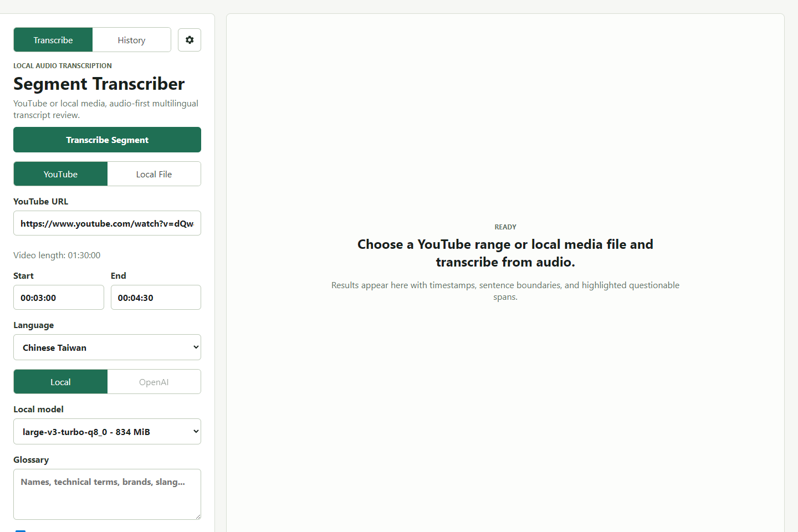
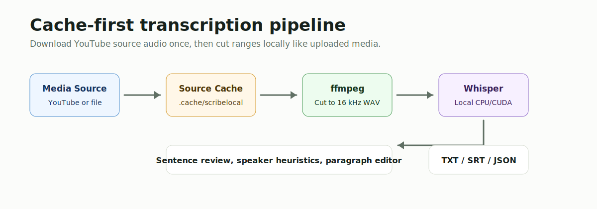
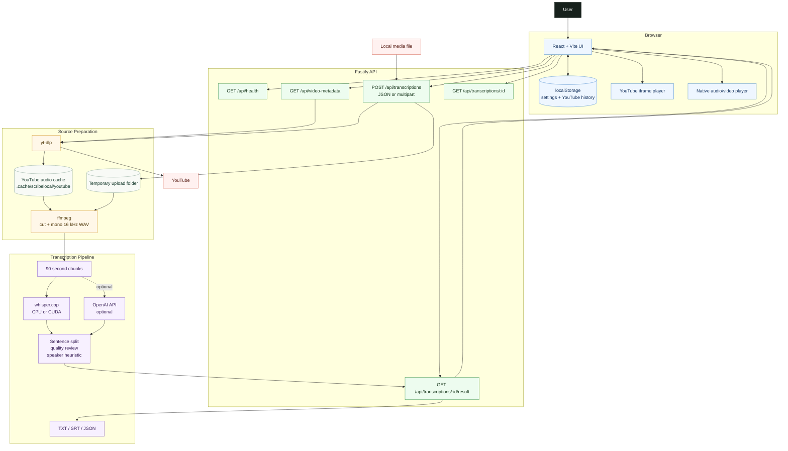

# ScribeLocal

Local-first transcription for YouTube segments and local audio/video files.



ScribeLocal is a local web app for transcribing only the part of a video or audio file you care about. It is built for media without captions, multilingual speech, and low-cost local workflows. The default path uses `whisper.cpp` on your machine, with optional OpenAI transcription if you add an API key.

## Why ScribeLocal

- Transcribe a selected `Start` to `End` range instead of a whole video.
- Use YouTube links or upload local audio/video files.
- Keep local mode as the default: `whisper.cpp`, `ffmpeg`, and local storage.
- Cache full YouTube source audio once, then cut future ranges locally.
- Support English, Traditional Chinese Taiwan, Indonesian, and code-switched English words.
- Review sentence-by-sentence timestamps, warnings, speaker labels, and edits.
- Switch to an editable paragraph transcript for clean copying.
- Sync transcript lines with YouTube playback or a native local media player.
- Export `TXT`, `SRT`, and `JSON`.



## Feature Map

| Area | What It Does |
| --- | --- |
| YouTube input | Regular links, Shorts, and `/live/...` URLs |
| Local file input | Audio/video upload with native playback after transcription |
| Cache-first extraction | Downloads best YouTube audio once into `.cache/`, then uses local `ffmpeg` cuts |
| Direct segment extraction | Optional legacy mode using `yt-dlp --download-sections` |
| Local transcription | `whisper.cpp` with CPU or CUDA builds |
| Optional API mode | OpenAI transcription when `OPENAI_API_KEY` is configured |
| Review workflow | Approve, mark for review, edit, reset, and inspect highlights |
| Interactive mode | Player and transcript stay synced while playback moves |
| Local settings | Browser-stored defaults for language, model, speed, and extraction mode |
| History | Browser-local YouTube history with title, thumbnail, range, and search |

## System Architecture



## How It Works

### YouTube Jobs

1. The browser sends a YouTube URL and selected time range.
2. The server reads metadata with `yt-dlp`.
3. In `cache-first` mode, the server checks `.cache/scribelocal/youtube/`.
4. On a cache miss, it downloads full best-audio once with `yt-dlp`.
5. On a cache hit, it skips the YouTube download.
6. `ffmpeg` cuts the selected range from cached audio and converts it to mono `16 kHz` WAV.
7. The app chunks the WAV, transcribes it, reviews sentence quality, and streams partial results.

`direct-segment` mode is still available in Settings. It uses the older `yt-dlp --download-sections` path.

### Local File Jobs

1. The browser uploads an audio/video file as multipart form data.
2. The server stores it in a temporary folder.
3. `ffmpeg` cuts the selected range and creates mono `16 kHz` WAV.
4. The same chunking, transcription, review, and export pipeline runs.
5. The UI shows a native player synced with transcript lines.

Local uploads are not stored in History because browsers do not expose stable reusable paths to local files.

## Requirements

Required:

- Node.js 20+
- `ffmpeg`
- `whisper.cpp`
- A Whisper GGML model file

Required for YouTube links:

- `yt-dlp`

Optional:

- NVIDIA GPU with a CUDA/cuBLAS `whisper.cpp` build
- `OPENAI_API_KEY` for optional API mode

## Recommended Models

| Model | Approx Size | Use Case |
| --- | ---: | --- |
| `ggml-large-v3-turbo-q8_0.bin` | 834 MiB | Default balance for multilingual local use |
| `ggml-large-v3-turbo-q5_0.bin` | 547 MiB | Lower storage and memory |
| `ggml-large-v3.bin` | 2.9 GiB | Heavier, sometimes higher accuracy |

Avoid `.en` models because this project targets English, Traditional Chinese Taiwan, Indonesian, and mixed-language speech.

## Setup

Install dependencies:

```powershell
npm install
```

Copy environment file:

```powershell
Copy-Item .env.example .env
```

Configure `.env`:

```env
WHISPER_CPP_BIN=C:\path\to\whisper-cli.exe
WHISPER_MODEL_PATH=C:\path\to\models\ggml-large-v3-turbo-q8_0.bin
WHISPER_MODEL_PATH_LARGE_V3_TURBO_Q8_0=C:\path\to\models\ggml-large-v3-turbo-q8_0.bin
WHISPER_MODEL_PATH_LARGE_V3_TURBO_Q5_0=
WHISPER_MODEL_PATH_LARGE_V3=
YTDLP_BIN=yt-dlp
FFMPEG_BIN=ffmpeg
YOUTUBE_CACHE_DIR=
UPLOAD_MAX_BYTES=2147483648
PORT=8787
OPENAI_API_KEY=
```

Start the app:

```powershell
npm run dev
```

Open:

```text
http://127.0.0.1:5173
```

## Download Helpers

Example Windows CPU setup:

```powershell
New-Item -ItemType Directory -Force -Path tools\downloads, tools\whisper.cpp, models
curl.exe -L -o tools\downloads\whisper-bin-x64.zip https://sourceforge.net/projects/whisper-cpp.mirror/files/v1.8.2/whisper-bin-x64.zip/download
tar -xf tools\downloads\whisper-bin-x64.zip -C tools\whisper.cpp
curl.exe -L -o models\ggml-large-v3-turbo-q8_0.bin "https://huggingface.co/ggerganov/whisper.cpp/resolve/main/ggml-large-v3-turbo-q8_0.bin?download=true"
```

For CUDA, set `WHISPER_CPP_BIN` to a CUDA/cuBLAS `whisper-cli.exe`. The model file stays the same.

## Usage

### YouTube

1. Choose `YouTube`.
2. Paste a supported URL.
3. Wait for duration lookup.
4. Set `Start` and `End`.
5. Choose language, model, and provider.
6. Keep `cache-first` extraction for repeated or long work.
7. Click `Transcribe Segment`.

### Local File

1. Choose `Local File`.
2. Click `Choose media file`.
3. Pick an audio or video file.
4. Set `Start` and `End`.
5. Click `Transcribe File`.

### Review And Export

- Use `Transcript` for timestamped sentence review.
- Use `Paragraph` for editing one copyable text block.
- Use Interactive Mode to keep media and transcript scrolling together.
- Export `TXT`, `SRT`, or `JSON`.

## API Overview

```text
GET  /api/health
GET  /api/video-metadata?youtubeUrl=...
POST /api/transcriptions
GET  /api/transcriptions/:jobId
GET  /api/transcriptions/:jobId/result
GET  /api/transcriptions/:jobId/result?format=txt
GET  /api/transcriptions/:jobId/result?format=srt
```

`POST /api/transcriptions` accepts JSON for YouTube jobs and multipart form data for uploaded local files.

## Environment Variables

| Variable | Purpose |
| --- | --- |
| `WHISPER_CPP_BIN` | Path to `whisper-cli` |
| `WHISPER_MODEL_PATH` | Default fallback model path |
| `WHISPER_MODEL_PATH_LARGE_V3_TURBO_Q8_0` | Model path for `large-v3-turbo-q8_0` |
| `WHISPER_MODEL_PATH_LARGE_V3_TURBO_Q5_0` | Model path for `large-v3-turbo-q5_0` |
| `WHISPER_MODEL_PATH_LARGE_V3` | Model path for `large-v3` |
| `YTDLP_BIN` | Path or command name for `yt-dlp` |
| `FFMPEG_BIN` | Path or command name for `ffmpeg` |
| `YOUTUBE_CACHE_DIR` | Optional YouTube source audio cache directory |
| `UPLOAD_MAX_BYTES` | Maximum local upload size, default `2147483648` |
| `PORT` | Backend port, default `8787` |
| `OPENAI_API_KEY` | Enables optional OpenAI mode |
| `LOG_LEVEL` | Fastify log level, default `warn` |

## Development

```powershell
npm run dev
npm test
npm run build
npm start
```

Update the README interface screenshot:

```powershell
npm run docs:screenshot
```

The screenshot command starts the dev server when needed, fills the UI with a sample YouTube URL, and writes `docs/assets/interface-screenshot.png`. Set `README_SCREENSHOT_YOUTUBE_URL` to capture a different video.

Project layout:

```text
src/
  client/       React UI
  server/       Fastify API and transcription pipeline
  shared/       Shared TypeScript types
tests/          Vitest tests
docs/assets/    README images
tools/          Local ignored binaries
models/         Local ignored Whisper models
```

## Git Ignore Notes

Do not commit local tools, models, cache, build output, or private environment files.

```gitignore
models/
tools/
.env
.cache/
node_modules/
dist/
```

## Troubleshooting

### Local setup is incomplete

Check `/api/health` or the UI warning. Confirm `WHISPER_CPP_BIN`, model paths, `FFMPEG_BIN`, and `YTDLP_BIN`.

### GPU is not used

Make sure `WHISPER_CPP_BIN` points to a CUDA/cuBLAS build of `whisper-cli`, not the CPU build.

### YouTube extraction is slow

Use `cache-first`. The first run still downloads source audio, but repeated ranges from the same video should skip that cost. To clear the cache, delete `.cache/scribelocal/youtube/` or your custom `YOUTUBE_CACHE_DIR`.

### Chinese audio becomes English

Set the language hint to `Chinese Taiwan`. Auto detection can fail when audio contains technical terms or code-switching.

### Local upload is rejected

Increase `UPLOAD_MAX_BYTES` in `.env`, then restart the server.

## Current Limits

- Speaker diarization is heuristic, not true diarization.
- Local upload history is not persisted.
- YouTube source audio cache uses disk space until manually deleted.
- Jobs are stored in memory and reset when the server restarts.
- Long videos still depend on network speed, model size, CPU/GPU, and chunk count.

## License

No license has been added yet. Add a license before publishing as a public open-source repository.
